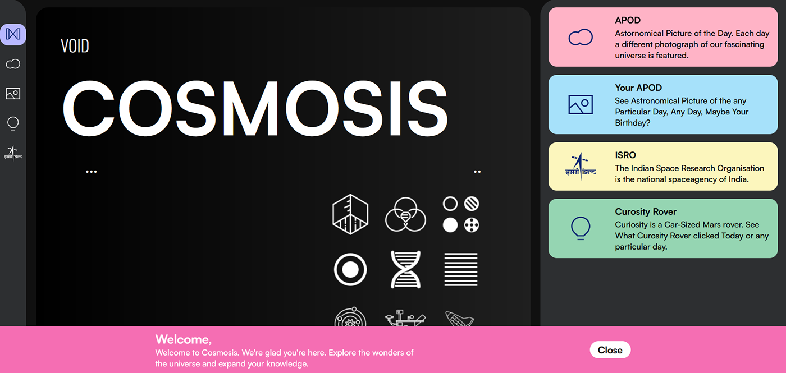

# 🌃 Anirudh Singh Bhadauria

**`NEXT Developer | REACT Developer | UI/UX Designer`**

Hello there! I'm a passionate Software-Engineer with the purpose of learning as much as I can to have the ability to provide and help the entire world with technology advancing projects/products. I'm currently working on personal projects and improving my React, NEXT skills.

## **✨ Languages and Tools**

 
 

## **⚡ Stats**

<table border="0" width='100%'>
 <tr>
<td>

</td>
<td>

</td>
 </tr>
</table>

## **🧨 Project Snapshots**

<table border="0" width='100%'>
 <tr>
<td>

<a href='https://www.google.com/'>Cosmosis</a>

</td>
<td>

<a href='https://www.google.com/'>Cosmosis</a>

</td>
<td>

<a href='https://www.google.com/'>Cosmosis</a>

</td>
</tr>

 <tr>
<td>

<a href='https://www.google.com/'>Cosmosis</a>

</td>
<td>

<a href='https://www.google.com/'>Cosmosis</a>

</td>
<td>

<a href='https://www.google.com/'>Cosmosis</a>

</td>
 </tr>
 
 <tr>
<td>

<a href='https://www.google.com/'>Cosmosis</a>

</td>
<td>

<a href='https://www.google.com/'>Cosmosis</a>

</td>
<td>

<a href='https://www.google.com/'>Cosmosis</a>

</td>
 </tr>

</table>
